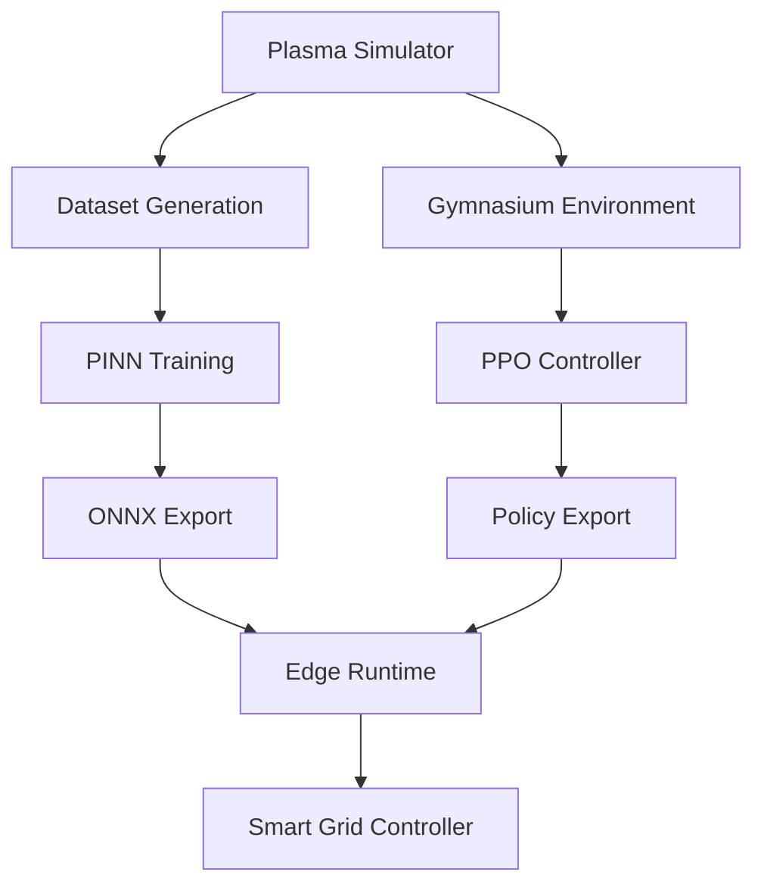

# Project AEGIS: Autonomous Fusion Plasma & Grid Brain 🌍⚡

[](https://pytorch.org/)
[](https://stable-baselines3.readthedocs.io/)
[](https://onnx.ai/)
[](https://python.org/)
[](LICENSE)

> **Energy is the bottleneck of human progress. Project AEGIS leverages Physics-Informed Neural Networks (PINNs) and Reinforcement Learning to autonomously stabilize fusion plasma and intelligently balance next-generation smart grids.**

## 📖 Professional Overview

Project **AEGIS** is a research-oriented Proof of Concept combining **Physics-Informed Neural Networks (PINNs)**, **Reinforcement Learning**, and **edge AI deployment** into a unified pipeline for autonomous fusion plasma control.

Instead of relying on computationally expensive 3D Magnetohydrodynamic (MHD) simulations, AEGIS demonstrates a lightweight **1D resistive MHD simulator** implemented in PyTorch. Generated simulation data trains neural networks capable of predicting plasma behaviour while reinforcement learning agents learn optimal magnetic coil control policies.

The trained models are exported to **ONNX** and executed through a simulated edge-computing pipeline representing a real-time smart-grid controller.

---

## ✨ Key Features

- ⚛️ 1D Resistive MHD Plasma Simulator
- 🧠 Physics-Informed Neural Networks (PINNs)
- 🤖 PPO Reinforcement Learning Controller
- 🌐 Simulated Multi-Agent Control
- ⚡ Smart Grid Edge Controller
- 📦 ONNX Model Export
- 🚀 ONNX Runtime Deployment
- 📊 Modular Training Pipeline

---

## 🏗 System Architecture



## 🛠 Technology Stack

| Category | Technologies |
|-----------|--------------|
| Language | Python |
| Deep Learning | PyTorch |
| Physics AI | PINNs |
| RL | Stable Baselines3 |
| Environment | Gymnasium |
| Deployment | ONNX, ONNX Runtime |
| Scientific Computing | NumPy, SciPy |
| Visualization | Matplotlib |

## 📂 Folder Structure

```text
.
├── deploy/
├── aegis/
│   ├── pinn_madrl/
│   └── plasma_sim/
├── main.py
└── README.md
```

## 🚀 Installation

```bash
git clone https://github.com/sivadst/project-aegis.git
cd project-aegis
pip install torch stable-baselines3 gymnasium onnx onnxruntime matplotlib numpy scipy
```

## ▶️ Usage

```bash
PYTHONPATH=. python main.py
```

## 📈 Pipeline

1. Generate plasma simulation data.
2. Train the PINN model.
3. Train PPO controller.
4. Export models to ONNX.
5. Run edge smart-grid simulation.

## 📊 Results

| Component | Status |
|-----------|--------|
| Plasma Simulator | ✅ |
| PINN Training | ✅ |
| PPO Training | ✅ |
| ONNX Export | ✅ |
| Edge Runtime | ✅ |

## 🛣 Roadmap

- ✅ Plasma Simulator
- ✅ PINN
- ✅ PPO
- ✅ ONNX Export
- ⬜ True Multi-Agent RL
- ⬜ TensorRT Deployment
- ⬜ Jetson Edge Deployment
- ⬜ 3D MHD Simulation

## 📷 Screenshots

- Plasma Simulator
- PINN Predictions
- PPO Reward Curve
- Grid Controller
- ONNX Export

## 📜 License

MIT License.

## 👨‍💻 Author

**Selvasiva S**

Integrated M.Tech CSE (Data Science)  
SRM University – AP

GitHub: https://github.com/sivadst

---

⭐ **Project AEGIS explores the intersection of Scientific Machine Learning, Physics-Informed AI, Reinforcement Learning, and Edge Computing for intelligent fusion-energy control systems.**
